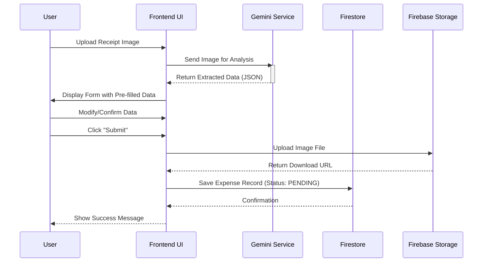
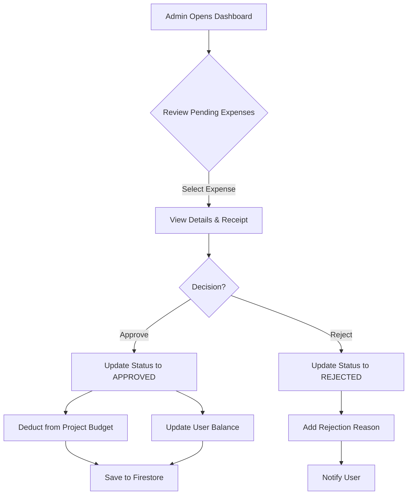

# SPI Smart Expense

A modern, intelligent expense tracking and management application designed to streamline the improved workflow between professionals submitting expenses and administrators managing project budgets.

This application leverages **Artificial Intelligence (Google Gemini)** to automate data entry from receipts, reducing manual errors and saving time.

---

## 🚀 Key Features

### 🤖 AI-Powered Expense Entry

- **Automated Parsing**: Upload a photo of a receipt or invoice, and the system automatically extracts the date, merchant, amount, tax ID, and more using **Google Gemini**.
- **Smart Categorization**: The AI suggests appropriate categories for expenses based on the context of the receipt.

### 👥 Role-Based Access Control

- **Professional Role**:
  - Scan and submit expenses.
  - View personal balance and reimbursement status.
  - Track expense history.
- **Admin Role**:
  - **Dashboard**: Overview of total project budgets and pending approvals.
  - **Project Management**: Create and manage projects, assign users, and set budgets.
  - **Approval Workflow**: Review, approve, or reject submitted expenses.
  - **User Management**: Manage user roles and balances.
  - **Seeding**: Tools for initial data population.

### 💰 Financial Management

- **Budget Tracking**: Real-time tracking of project budget consumption.
- **Balance Sheet**: Automated calculation of user balances (Advances vs. Expenses).
- **Multi-Currency Support**: Handles various currencies with normalization (e.g., COP, USD).

---

## 🛠 Technology Stack

- **Frontend Framework**: [React](https://react.dev/) (v19)
- **Build Tool**: [Vite](https://vitejs.dev/)
- **Styling**: [Tailwind CSS](https://tailwindcss.com/)
- **Backend / Database**: [Firebase](https://firebase.google.com/)
  - **Authentication**: Secure user login and role management.
  - **Firestore**: NoSQL database for real-time data syncing.
  - **Storage**: Secure storage for receipt images.
- **Artificial Intelligence**: [Google Gemini API](https://ai.google.dev/) (via `google-generative-ai` SDK)
- **Routing**: [React Router](https://reactrouter.com/) (v7)

---

## 🏗 Architecture Overview

The application follows a serverless architecture pattern, relying on Firebase for backend services and Google Gemini for cognitive tasks.

```mermaid
graph TD
    User[User (Web Browser)]

    subgraph "Frontend Client"
        Router[React Router]
        AuthCtx[Auth Context]
        Pages[UI Pages]
        Services[Service Components]
    end

    subgraph "External Services"
        FirebaseAuth[Firebase Auth]
        Firestore[Firestore DB]
        Storage[Firebase Storage]
        Gemini[Google Gemini API]
    end

    User -->|Interacts| Pages
    Pages -->|Navigates| Router
    Pages -->|Uses| AuthCtx

    AuthCtx -->|Authenticates| FirebaseAuth

    Pages -->|Reads/Writes Data| Services
    Services -->|CRUD Operations| Firestore
    Services -->|Upload Images| Storage

    Services -->|Analyze Image| Gemini
```

---

## 🔄 Functional Logic Workflows

### 1. Expense Submission Flow (Professional)

This workflow details how a user submits an expense using AI assistance.



### 2. Expense Approval Flow (Admin)

How an administrator reviews and approves expenses, affecting project budgets and user balances.



---

## 💻 Getting Started

### Prerequisites

- **Node.js** (v18 or higher)
- **npm** or **yarn**
- **Firebase Account**: You need a Firebase project with Auth, Firestore, and Storage enabled.
- **Google AI Studio Key**: An API key for Google Gemini.

### Installation

1.  **Clone the repository:**

    ```bash
    git clone https://github.com/your-username/spi-smart-expense.git
    cd spi-smart-expense
    ```

2.  **Install dependencies:**

    ```bash
    npm install
    # or
    yarn install
    ```

3.  **Environment Configuration:**
    Create a `.env` file in the root directory based on `.env.example`. Fill in your specific keys:

    ```env
    # Firebase Configuration
    VITE_FIREBASE_API_KEY=your_api_key
    VITE_FIREBASE_AUTH_DOMAIN=your_project.firebaseapp.com
    VITE_FIREBASE_PROJECT_ID=your_project_id
    VITE_FIREBASE_STORAGE_BUCKET=your_project.appspot.com
    VITE_FIREBASE_MESSAGING_SENDER_ID=your_sender_id
    VITE_FIREBASE_APP_ID=your_app_id

    # Google Gemini AI
    VITE_GEMINI_API_KEY=your_gemini_api_key
    ```

4.  **Run the Development Server:**
    ```bash
    npm run dev
    ```
    The application will typically start at `http://localhost:5173`.

---

## 📂 Project Structure

```
spi-smart-expense/
├── src/
│   ├── components/      # Reusable UI components (Buttons, Layouts)
│   ├── context/         # React Contexts (AuthContext)
│   ├── lib/             # External service wrappers (firebase.js, gemini.js)
│   ├── pages/           # Application views/routes
│   │   ├── Admin*.jsx   # Admin-specific pages
│   │   ├── User*.jsx    # User-specific pages
│   │   └── Login.jsx    # Authentication entry point
│   ├── utils/           # Helper functions
│   ├── App.jsx          # Main Router configuration
│   └── main.jsx         # Entry point
├── public/              # Static assets
└── ...config files      # (vite.config.js, tailwind.config.js, etc.)
```

---

## 🚀 Deployment

The project is configured for deployment on **Firebase Hosting**.

1.  **Build the project:**

    ```bash
    npm run build
    ```

2.  **Deploy to Firebase:**
    ```bash
    firebase deploy
    ```

---

## 📄 License

This project is proprietary software. All rights reserved.
